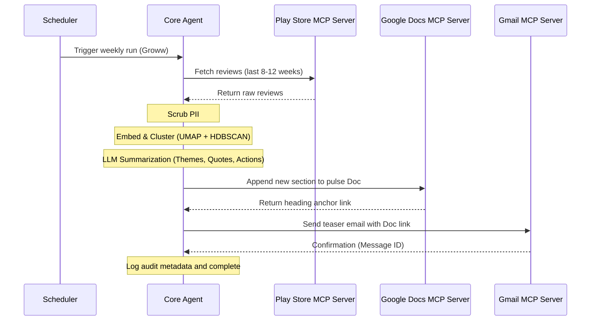

# Architecture: Weekly Product Review Pulse

This document outlines the architecture for the Weekly Product Review Pulse system, specifically tailored for the Groww platform using Google Play Store reviews. The system leverages the Model Context Protocol (MCP) to decouple data ingestion and delivery from the core reasoning agent.

## 1. System Overview

The system operates as an orchestrating Agent (MCP Client) that communicates with three distinct MCP servers to perform data retrieval and delivery. The Agent handles the scheduling, reasoning (clustering and LLM summarization), and coordinates the workflow. 

### Key Interactions
1. **Play Store Reviews MCP Server**: Ingests public app reviews.
2. **Google Docs MCP Server**: Appends the final report to a running system-of-record document.
3. **Gmail MCP Server**: Sends a teaser email to stakeholders with a link to the document.

---

## 2. Component Details

### 2.1 Core Agent (Orchestrator)
The brain of the operation, responsible for managing the pipeline:
- **Scheduler**: Triggers the workflow once a week (e.g., Monday morning IST). Supports a CLI interface for backfilling specific ISO weeks.
- **Idempotency Manager**: Ensures that re-running the same product + ISO week does not result in duplicate document sections or emails. It verifies state via stable section anchors in the Doc and run-scoped IDs.
- **Safety Layer**: Scrubs Personally Identifiable Information (PII) from reviews before processing and publishing. Applies cost/token limits.

### 2.2 Play Store Reviews MCP Server (Custom Built)
A dedicated MCP server created within this project.
- **Responsibility**: Scrapes or fetches public Google Play reviews for the Groww application.
- **Inputs**: App bundle ID, date range (e.g., last 8–12 weeks).
- **Outputs**: Slimmed down structured review data (primarily text and rating). Metadata such as `reviewId`, `userName`, `userImage`, `reviewCreatedVersion`, `at`, `replyContent`, and `repliedAt` are explicitly stripped out.

### 2.3 Reasoning & Processing Engine
Runs within or alongside the Core Agent to transform raw text into actionable insights.
- **Clustering Pipeline**: Computes text embeddings for incoming reviews and applies density-based clustering algorithms (e.g., UMAP + HDBSCAN) to identify groups of similar feedback.
- **LLM Summarization**: Analyzes clustered groups to:
  - Identify and name top recurring themes (e.g., "App performance & bugs").
  - Extract and validate verbatim user quotes (ensuring no hallucinations).
  - Propose actionable product/support ideas based on the feedback.

### 2.4 Google Workspace MCP Servers
Standardized remote MCP server (`web-production-85b327.up.railway.app`) used for all human-visible delivery. The Agent does not manage Google credentials directly.
- **Google Docs Operations**: Receives the structured report from the Agent and appends it to the master Groww Weekly Pulse Doc. Returns the anchor link to the newly created section.
- **Gmail Operations**: Receives a short summary and the Doc anchor link. Drafts and sends an email to predefined stakeholder groups. Can be configured to operate in "draft-only" mode for staging environments.

---

## 3. Data Flow

---

## 4. Security & Credentials
- **Credential Isolation**: Google OAuth credentials and tokens live entirely within the configurations of the Docs and Gmail MCP servers. The Core Agent remains credential-agnostic regarding delivery destinations.
- **Data Safety**: All review text is treated strictly as data (preventing prompt injection) and undergoes PII sanitization before leaving the ingestion boundary.

## 5. Extensibility
While initially locked to Google Play and the Groww app, the architecture supports adding Apple App Store ingestion via a new/updated MCP server, or adding new fintech products by simply expanding the scheduler configuration.
